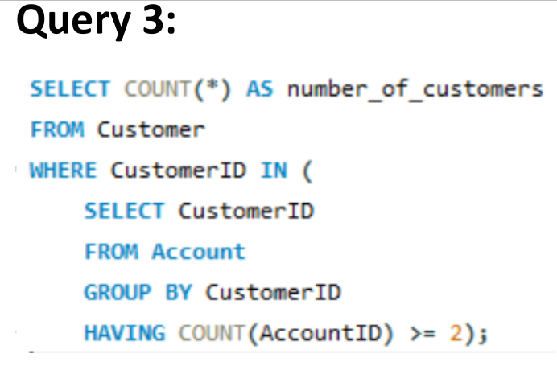

# The Honest Bank 🏦

Welcome to "The Honest Bank" project! This repository contains a comprehensive database system for a fictional bank, equipped with cryptocurrency functionalities. Our goal is to provide an honest and innovative banking experience that sets new standards in the financial sector. 🌟

## Table of Contents
- [Introduction](#introduction)
- [Database Design](#database-design)
- [Queries and Tasks](#queries-and-tasks)
- [Documentation](#documentation)
- [Future Enhancements](#future-enhancements)
- [Usage](#usage)
- [Contributing](#contributing)
- [Acknowledgments](#acknowledgments)

## Introduction 📜

Amidst challenging economic conditions and corruption in Lebanon, "The Honest Bank" aims to bring integrity and reliability to the banking industry. We've created a robust banking system designed to offer unique and honest services to customers, inspiring similar transformations in other institutions. 🇱🇧

## Database Design 🗂️

Our database system includes tables such as `Customer`, `Account`, `Transaction`, `CryptoWallet`, and more. It supports cryptocurrency functionality, customer details, transactions, and more. It's designed to be both practical and innovative. 🪙

### ER Diagram

### Entities and Their Attributes:
Customer: Stores customer details including name, address, and contact information. It has relationships with accounts, loans, and credit cards.

Account: Contains details about each account such as account number, type, and balance. It is linked to transactions and customers.

Transaction: Holds information about financial transactions, including amounts, dates, and types. Transactions are associated with accounts.

Loan: Records details of loans, including the loan ID, amount, interest rate, and purpose. It links to customers and specific loan types like home or student loans.

Credit Card: Contains credit card details such as number, expiration date, and credit limit.

Crypto-Wallet: Includes fields for wallet names and balances, and is associated with a cryptocurrency.

CryptoCurrency: Holds information about different cryptocurrencies, their market price, and associated news.

Branch: Represents bank branches with attributes like branch name and location, and is related to employees.

Employee: Stores employee details including name, position, and salary. Employees are associated with branches and can manage departments or supervise other employees.

ATM: Contains details about ATMs, including location and cash balance.

Department: Details the departments within the bank, including a description and budget.

Dependent: Represents people who are dependents of the bank's employees.

### Relationships:
Customer-Account: A one-to-many relationship indicating that a customer can own multiple accounts.

Account-Transaction: A one-to-many relationship showing that each account can have multiple transactions.

Customer-Loan: A one-to-many relationship where a customer can have multiple loans.

Customer-Credit Card: A one-to-many relationship indicating a customer can have several credit cards.

Customer-Crypto-Wallet: A one-to-many relationship indicating that a customer can own multiple crypto-wallets.

Crypto-Wallet-CryptoCurrency: A many-to-many relationship managed via a linking entity, indicating that a wallet can contain multiple types of cryptocurrencies and a cryptocurrency can be in multiple wallets.

Branch-Employee: A one-to-many relationship where a branch can employ multiple employees.

Employee-Department: A many-to-one relationship indicating that employees work in a department, and a department can have many employees.

ATM-Branch: A one-to-many relationship where each branch can have multiple ATMs.

Employee-Dependent: A one-to-many relationship showing that an employee can have multiple dependents.

Significance of the ERD:
This ERD is significant as it:

Provides a comprehensive view of the data structure within a banking system.

Facilitates understanding of how different entities are related to each other.

Helps in designing the database and ensuring data consistency and integrity.

Serves as a blueprint for the creation of database tables and their relationships.

Is a valuable tool for communication among stakeholders, developers, and database designers in the development process.

The ERD reflects a complex banking system capable of handling various banking operations, including the management of traditional banking products as well as modern financial products like cryptocurrencies. It shows a system designed to provide a holistic set of services to its customers, from everyday transactions to investment in cryptocurrencies.

### Database Tables

## Queries and Tasks 📊

We've developed a wide range of SQL queries and tasks to demonstrate the functionality of our database system. These queries cover scenarios such as extracting customer data, assessing employee salaries, calculating average balances, and much more. 📝

### Explore Advanced Queries:

#### Query 1: [Description of Query 1]

##### Description:
This query selects unique customers from the Customer table who have performed transactions greater than 10,000 units (the currency is not specified). It does this by:

Selecting distinct CustomerID, cFirstName, and cLastName from the Customer table.
Filtering this list to include only those customers who have an associated Account and have undergone transactions (Undergoes table seems to be a link/junction table between Account and Transaction) with an amount over 10,000.

##### Significance:
The query is significant because it helps identify high-value transactions within the bank, which can be useful for several purposes:

Anti-Money Laundering (AML) Compliance: Banks need to monitor large transactions to comply with AML regulations.
Customer Service: High-value transactions may flag a customer for premium services or personal account management.
Risk Management: Transactions of large amounts could indicate potential risks to the bank and might require further investigation.
This query showcases the database's ability to provide critical business intelligence that can aid in decision-making processes and regulatory compliance. It's an example of the kind of insights the database system of "The Honest Bank" is capable of generating to support the bank's operations.

#### Query 2: [Description of Query 2]

##### Description:
This query selects all columns (*) from the Employee table for those employees whose salary is greater than the average salary of employees in the same branch. The subquery calculates the average salary for each branch, and then the main query uses this to filter and retrieve only those employees earning more than this branch average.

##### Significance:
The significance of this query lies in its ability to:

Identify High Earners: Helps in identifying employees who are earning above the average in their respective branches, which could be used for performance evaluations or for monitoring compensation policies.
Internal Equity Analysis: The query can be part of an internal equity analysis to ensure that employees are paid fairly in relation to their colleagues.
Budget Planning: Useful for budgeting and financial planning within the bank, as it highlights the distribution of salaries across different branches.
Salary Review Processes: It can be used during salary reviews to adjust compensation structures or during appraisals to reward high-performing employees.
The query demonstrates the use of subqueries and aggregate functions to perform complex data analysis within the "The Honest Bank" database system, reflecting the bank's commitment to fair employee compensation and strategic financial management.

#### Query 3: [Description of Query 3]

##### Description:
This query calculates the number of customers who have two or more accounts with the bank. It does this by:

Using a subquery to select CustomerID from the Account table, grouping the results by CustomerID, and applying a HAVING clause to filter out only those customers who have two or more accounts (indicated by COUNT(AccountID) >= 2).
The main query then counts the total number of distinct CustomerIDs that meet this criterion.

##### Significance:
The significance of Query 3 is multifaceted:

Customer Segmentation: It enables the bank to segment customers based on the number of accounts they hold, which can be a sign of customer engagement and loyalty.
Marketing Strategies: This information is valuable for targeted marketing strategies, as customers with multiple accounts may be more receptive to cross-selling or upselling opportunities.
Service Planning: Understanding how many customers have multiple accounts can help in planning for customer service resources, as these customers may require more support.
Risk Assessment: For risk management purposes, knowing the number of accounts per customer can help in assessing the risk profile of the bank's customer base.
This query illustrates the database's utility in supporting strategic business decisions through detailed data analysis. It shows that "The Honest Bank" is leveraging its database not only for operational purposes but also for enhancing its understanding of customer behavior and needs.

#### Query 4: [Description of Query 4]

##### Description:
This complex query is designed to retrieve the EmployeeID and ename (likely representing the employee's name) from the Employee table for those employees who work at branches where there are customers with a CryptoWallet balance greater than 10,000 and who also own two or more distinct wallets.

The logic behind this query involves several nested operations:

It first identifies customers with a CryptoWallet balance over 10,000.
Then, it filters these customers further to those who have at least two different wallets associated with cryptocurrencies.
Finally, it identifies the employees who work at the same branches as these customers.

##### Significance:
The significance of Query 4 includes:

Targeted Employee Training: Identifying employees who work at branches with high-value cryptocurrency customers could be used to target specific training or resources to those employees about cryptocurrency management and security.
Branch Performance Analysis: It can help analyze the performance of branches that are dealing with high-net-worth individuals, especially in the context of modern banking services like cryptocurrency.
Customer Relationship Management (CRM): Employees at these branches may require additional CRM strategies to cater to the unique needs of these technologically savvy customers.
Strategic Planning: For strategic planning purposes, this information can be used to decide where to allocate resources, introduce new crypto-related services, or expand the staff with specialized knowledge in crypto assets.
This query showcases the bank's ability to integrate traditional banking data with modern financial services like cryptocurrency, reflecting "The Honest Bank"'s commitment to innovation and customer service in the digital age.

#### Query 5: [Description of Query 5]

##### Description:
This query selects the CustomerID from the Customer table where there is no existing BranchID that the customer does not have an account in. In other words, it finds customers who have accounts in every branch of the bank.

The EXCEPT clause is used to subtract the set of BranchIDs where the customer has an account from the set of all BranchIDs. The NOT EXISTS clause then finds any customer for whom this resulting set is empty, implying that the customer has covered all branches.

##### Significance:
The significance of Query 5 can be interpreted in various ways:

Comprehensive Banking Relationships: It identifies customers with a widespread banking relationship, having accounts in every branch. These could be very valuable customers for the bank.
Market Penetration Analysis: The query can be useful for analyzing the market penetration of the bank's services across different branches.
Customer Loyalty and Retention: Identifying such customers can be critical for customer loyalty and retention programs, as they are likely to be highly engaged with the bank.
Customized Service Offerings: The bank may want to offer personalized services or benefits to these customers as a reward for their comprehensive engagement with the bank's network.
This query demonstrates the bank's capability to use complex SQL operations to gain insights into the banking habits of their customers, which can be leveraged for strategic business decisions and enhanced customer service offerings.

#### Query 6: [Description of Query 6]

##### Description:
This query performs the following operations:

It creates a derived table BranchBalances that contains BranchID and Balance from the Account table.
It then calculates the average balance (AverageBalance) for each branch by grouping the results based on BranchID.

##### Significance:
The significance of Query 6 includes:

Financial Analysis: It provides an important metric for financial analysis, giving insight into the average funds held at each branch, which can indicate the branch's performance and customer wealth level.
Strategic Decision-Making: The bank can use this data for strategic decision-making, such as where to allocate resources or open new branches.
Resource Allocation: Understanding the average balance per branch can help in allocating staff and other resources to meet the demands of customers at each branch more effectively.
Risk Management: This information can also be important for risk management, as branches with higher average balances may need more stringent security measures.
This query is a good example of how aggregated financial data can be used to gain insights into the operational aspects of the bank and how it can inform various strategic initiatives within "The Honest Bank."

#### Query 7: [Description of Query 7]

##### Description:
This query is using correlated subqueries to calculate two pieces of data for each branch in the Branch table:

EmployeeCount: The total number of employees at each branch, obtained by counting all entries in the Employee table for the corresponding BranchID.
AverageSalary: The average salary of employees at each branch, calculated by averaging the Salary column in the Employee table for each respective BranchID.
These subqueries are correlated because they reference the BranchID from the outer query.

##### Significance:
The significance of Query 7 includes:

Human Resources Planning: It provides essential data for human resource planning, including staffing levels and budgeting for salaries at each branch.
Operational Insights: The query offers insights into the operational cost structure of each branch, which can help in performance evaluation and strategic planning.
Financial Oversight: Knowing the average salary per branch can be critical for financial oversight, as it may indicate discrepancies or inequalities that need to be addressed.
Branch Comparison: This data is useful for comparing branches against each other regarding staff size and compensation, which can inform decisions on promotions, raises, and hiring.
Overall, Query 7 demonstrates the capability of the database system at "The Honest Bank" to provide detailed workforce analytics that are vital for effective branch management and strategic decision-making.

#### Query 8: [Description of Query 8]

##### Description:
The query updates the CreditLimit field in the CreditCard table. It uses a CASE statement to determine the new credit limit based on the balance of the customer's CryptoWallet:

If the CryptoWallet balance is less than 5000, the credit limit is set to 10000.
If the balance is between 5000 and 10000, the credit limit is set to 15000.
Otherwise, the credit limit is set to 20000.
The query joins the CreditCard and CryptoWallet tables on the CustomerID to ensure the credit limit is updated for the corresponding customer's credit card based on their CryptoWallet balance.

##### Significance:
The significance of Query 8 includes:

Credit Risk Management: Adjusting credit limits based on the customer's financial position (in this case, indicated by their CryptoWallet balance) helps in managing credit risk.
Dynamic Credit Limit Adjustments: Automatically updating credit limits in response to changes in customer balances reflects a dynamic approach to credit management.
Customer Incentivization: This strategy could incentivize customers to maintain higher balances in their CryptoWallets in order to receive higher credit limits.
Financial Product Integration: It shows the bank's effort to integrate traditional banking products (like credit cards) with modern financial products (like CryptoWallets), potentially offering a more tailored financial service.
Overall, Query 8 is an example of how "The Honest Bank" may be using automation within its database system to dynamically adjust financial products based on customer activity and balance, demonstrating a sophisticated approach to financial services.

#### Query 9: [Description of Query 9]

##### Description:
This query selects the EmployeeID, ename (which likely stands for the employee's name), and dname (which likely stands for the department name) from the Employee table. It performs a LEFT OUTER JOIN with the Department table, based on a match between Employee.BranchID and Department.DepartmentID.

A LEFT OUTER JOIN is used to include all records from the Employee table and the matched records from the Department table. If there is no match, the result is NULL on the side of the department.

##### Significance:
The significance of Query 9 includes:

Employee-Department Relations: It helps in understanding the relationship between employees and their departments or branches, which is crucial for managing an organization's structure.
Inclusive Data Retrieval: By using a LEFT OUTER JOIN, the query ensures that employees who do not belong to a department (or whose department ID does not match any entry in the Department table) are also included in the result set.
HR Management: This query is significant for HR management purposes, allowing the bank to generate comprehensive reports on employee assignments and departmental structures.
Data Integrity Checks: It can also be used for data integrity checks to ensure that every employee is correctly associated with a department.
Overall, Query 9 demonstrates the bank's ability to use SQL queries to manage and analyze its organizational structure effectively, ensuring that all employees are accounted for and properly aligned with their respective departments or branches within "The Honest Bank."

#### Query 10: [Description of Query 10]

##### Description:
This statement attempts to create an assertion named MaxEmployeeLimit. The purpose of this assertion is to enforce a business rule that no branch should have more than 100 employees. The NOT EXISTS clause checks that there is no BranchID in the Employee table with a count of EmployeeID greater than 100.

##### Significance:
The significance of Query 10 includes:

Enforcing Business Rules: It enforces a business rule at the database level, which means that the rule is applied consistently across all applications using this database.
Data Integrity: The assertion helps maintain data integrity by ensuring that the employee count per branch does not exceed a set limit.
Human Resource Planning: It aids in human resource planning by preventing overstaffing at any given branch.
Operational Efficiency: Ensuring a balanced distribution of employees can lead to more efficient operation and management of bank branches.

#### Query 11: [Description of Query 11]

##### Description:
This query creates a view named CustomerLoanDetails that consolidates loan information for each customer. It selects the customer's ID, first name, and last name from the Customer table and the total sum of loans from the Loan table, grouping the results by CustomerID. Essentially, this view will provide a quick reference to see each customer's total loan amount with the bank.

##### Significance:
The significance of Query 11 includes:

Financial Overview: It offers a financial overview of each customer's total loan amount, which is crucial for loan management and customer service.
Ease of Access: Creating a view simplifies access to complex queries by encapsulating the query logic. Users can select from the view without writing the underlying query each time.
Data Analysis: This view can be used for data analysis purposes, such as identifying high-value customers or assessing the loan portfolio's health.
Reporting: It can be very useful for reporting purposes, allowing the bank to generate reports on loan distributions and customer debt levels quickly.
By creating this view, "The Honest Bank" is enabling efficient access to summarized loan data, which can support a range of operational and strategic business decisions.

#### Query 12: [Description of Query 12]

##### Description:
This function CalculateTotalBalance is designed to calculate the total balance across all accounts for a given customer. It accepts one integer parameter, customer_id, representing the ID of the customer whose total balance needs to be calculated.

Inside the function:

It declares a variable total_balance of type DECIMAL(10, 2), which means it can hold a number with up to 10 digits, two of which can be after the decimal point.
It then calculates the sum of the Balance column from the Account table for the given customer_id and stores the result in the total_balance variable.
Finally, it returns the total_balance variable.

##### Significance:
The significance of Query 12 includes:

Automating Calculations: By encapsulating the balance calculation in a function, the bank automates the process of tallying a customer's total balance across all accounts.
Reducing Errors: Functions help reduce errors in repetitive calculations, ensuring consistent results across different banking applications.
Simplifying Queries: The function simplifies complex SQL queries that applications might need to perform, making it easier for them to retrieve a customer's total balance by calling a function.
Efficiency: It can improve the efficiency of the bank's operations by providing a quick and reliable way to access important financial data.
Overall, Query 12 shows "The Honest Bank"'s use of stored functions to streamline database operations, ensuring that applications that need to calculate a customer's total balance can do so quickly and without duplicating SQL code.

#### Query 13: [Description of Query 13]

##### Description:
This function evaluates a customer's eligibility for a loan based on their total balance and the duration of their relationship with the bank. It performs the following actions:

Declares variables for eligibility, total balance, account opening date, and years with the bank.
Calls a previously defined function, CalculateTotalBalance, to get the customer's total balance.
Retrieves the earliest account opening date for the customer from the Account table.
Calculates the number of years the customer has been with the bank using the TIMESTAMPDIFF function.
Determines the customer's loan eligibility. If the customer has a total balance greater than 5000 and has been with the bank for more than two years, they are deemed eligible for a loan.

##### Significance:
The significance of Query 13 includes:

Automated Loan Eligibility: The function automates the process of determining a customer's eligibility for a loan, which can increase efficiency in the loan application process.
Consistency in Decision-Making: By codifying the eligibility criteria within a function, the bank ensures consistent application of these criteria.
Customer Relationship Value: The function takes into account not just the customer's current financial status (total balance) but also their relationship duration with the bank, which can foster customer loyalty and trust.
Risk Management: This approach helps in managing the bank's risk by setting a threshold for loan eligibility based on quantifiable and historical data.
Overall, Query 13 exemplifies "The Honest Bank's" use of database functions to streamline complex business logic, such as loan eligibility, ensuring a systematic and efficient banking process.

#### Query 14: [Description of Query 14]

##### Description:
This stored procedure is designed to update the address details of a customer in the Customer table. The procedure takes five parameters:

cust_id: The unique identifier of the customer whose address is being updated.
new_country: The new country name for the customer's address.
new_city: The new city name for the customer's address.
new_zipcode: The new zipcode for the customer's address.
new_street: The new street name for the customer's address.
The UPDATE statement within the procedure modifies the Customer table by setting the country, city, zipcode, and street to the new values provided, for the record where CustomerID matches the cust_id parameter.

##### Significance:
The significance of Query 14 includes:

Data Management: The procedure provides a structured way to update customer address details, which is essential for maintaining accurate customer records.
Operational Efficiency: By encapsulating the update logic within a procedure, the bank reduces the potential for errors and increases efficiency when address changes are required.
Customer Service: Quick and accurate updating of customer information is key to providing good customer service, especially in banking where address details can be crucial for communication and legal compliance.
Security: Stored procedures can provide an additional layer of security, as they can be granted specific execute permissions, thus limiting direct access to the database tables.
Overall, Query 14 demonstrates "The Honest Bank's" commitment to maintaining up-to-date customer information in a secure and efficient manner, which is vital for operational excellence and customer satisfaction.

#### Query 15: [Description of Query 15]

##### Description:
This stored procedure is intended to create a new account in the Account table. It performs the following actions:

Takes four parameters: the type of account to create, the initial balance for the new account, the ID of the customer for whom the account is being created, and the ID of the branch where the account is being opened.
Declares a new variable new_account_id to store the generated ID for the new account.
Calculates the next account ID by finding the highest existing AccountID in the Account table and adding 1 to it.
Inserts a new record into the Account table with the generated new_account_id, the provided account_type, initial_balance, current date as the DateOpened, and the provided customer_id and branch_id.

##### Significance:
The significance of Query 15 includes:

Automating Account Creation: The procedure automates the process of creating a new account, making it more efficient and less prone to error than manually inserting records.
Ensuring Unique IDs: By generating the account ID within the procedure, it ensures that each account has a unique identifier.
Streamlining Operations: This procedure can be used by the bank's staff or through their banking application to streamline the operation of opening new accounts for customers.
Data Consistency: It maintains data consistency by ensuring that all relevant fields are populated when a new account is created.
Overall, Query 15 demonstrates "The Honest Bank's" use of stored procedures to streamline and standardize database operations, improving the efficiency and reliability of their banking services.

## Documentation 📚

Meticulous documentation accompanies every aspect of our project. It not only records what we've done but also reflects our thought process and understanding of each component. Realistic scenarios for each SQL query demonstrate practical applications and problem-solving abilities. 🧐

- [Read Full Documentation](Honest-Bank-Final.pdf)

## Future Enhancements 🚀

Looking ahead, we plan to incorporate real-world banking data to refine and enhance our database. We'll add more triggers, functions, and procedures to make the database even more dynamic and responsive to evolving banking needs. Stay tuned for updates! 🌐

## Usage 💼

To use "The Honest Bank" project, follow these steps:

1. Connect to the MySQL database.
2. Run SQL queries from the Queries and Tasks document to interact with the database.
3. Explore the database's capabilities and functionalities.

## Contributing 🤝

We welcome contributions from the community to improve "The Honest Bank." Feel free to submit issues, suggest enhancements, or create pull requests. Together, we can make this project even better! 🌟

## Acknowledgments 🙏

We extend our heartfelt gratitude to our professor, Dr. Khaleel Mershad, for his invaluable guidance and support throughout this project. We also thank LAU for providing us with the opportunity to learn and grow together with passionate peers. This project is a testament to our dedication to learning and our aspiration to contribute positively to a brighter Lebanon. 🌍

THE END
We hope you enjoy "The Honest Bank." 💼

